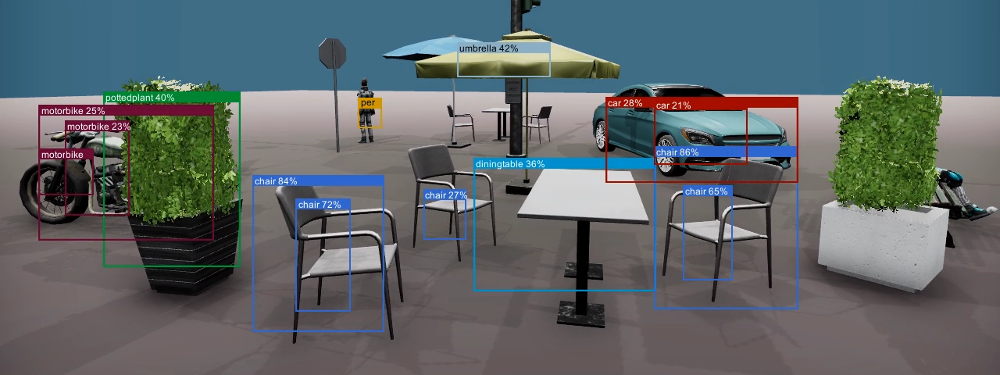

## YOLO Object Detection for Unity (Windows)

Experimental [Yolo object detection](https://github.com/AlexeyAB/darknet) for Unity (Windows) via [gRPC](https://github.com/grpc/grpc). Uses the [Alturos Yolo wrapper](https://github.com/AlturosDestinations/Alturos.Yolo), please see corresponding [system and build requirements](https://github.com/AlturosDestinations/Alturos.Yolo#system-requirements).

### How to use
- Build YoloSrc\Yolo.sln
- Publish YoloServer project
- Launch YoloSrc\YoloServer\bin\Release\netcoreapp2.1\win-x64\YoloServer.exe
- Open YoloUnity project and enter play mode

Exit and re-enter play mode in case you get an RPC failed Grpc.Core.RpcException.